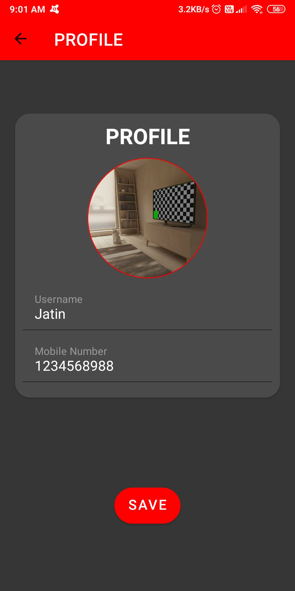
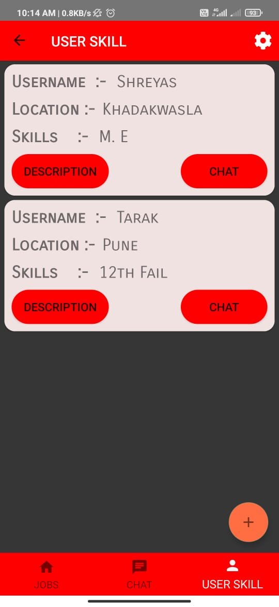

# HireASkill

### Problem Statement:
Everyone knows platforms like linkedIn, Intershala, Hirect, Naukri.com. All these platform are very good and there are so many other plaforms also available same as like these. But I haven't found any platform which provide jobs, work opportunites for unprofessional, those who don't have any degree and certification. There are so many type of works are there like work as a maid, waiter, gardener, normal person for single day work, so work can be of any kind but we don't get people for that work easily. We need to make so many contacts to find such people. So looking at this scenario we got a motivation to devlope an app which provide platform for everyone.

### Proposed Solution:
HireAskill is a revolutionary platform designed to empower both professionals and nonprofessionals, providing opportunities for individuals without formal qualifications to find work and earn money. Our app offers a seamless solution for job seekers to easily secure nearby jobs tailored to their skills and preferences, while catering specifically to the needs of local businesses and laborers who often face difficulty in finding suitable work.

Key Features:

Accessibility and Convenience: With HireAskill, finding a job near your location has never been easier. Our user-friendly app simplifies the job search process, allowing individuals to browse and apply for various professional and nonprofessional roles with just a few taps on their phone. Whether you're a skilled professional looking for extra work or someone seeking part-time or temporary employment, our platform makes it convenient to find and secure jobs that match your availability and capabilities.

Focused on Local Businesses: We understand the challenges faced by local businesses in sourcing reliable laborers. HireAskill addresses this gap by connecting businesses with a diverse pool of talented professionals and nonprofessionals in their area. By utilizing our platform, businesses can effortlessly post job listings and connect with individuals possessing the right skills for their specific requirements. Our streamlined hiring process ensures that local businesses can quickly and efficiently find the right talent to fulfill their job needs.

Supporting Local Laborers: We are committed to providing opportunities for individuals who may not have formal qualifications but possess valuable skills. HireAskill offers a platform where such individuals can showcase their abilities and connect with local businesses seeking their expertise. By focusing on local laborers, we foster a sense of community, promote economic growth, and contribute to the overall development of the local workforce.

Upcoming Functionality: We are continuously working on enhancing our platform to better serve our users. One of our upcoming features is the addition of a nearby jobs functionality. This new feature will further improve the user experience by presenting job seekers with a curated list of opportunities in close proximity to their location, ensuring they can find work conveniently and efficiently.

### Application Images:  
                                                                              
                                  
                                 
                                 
                                  
 
